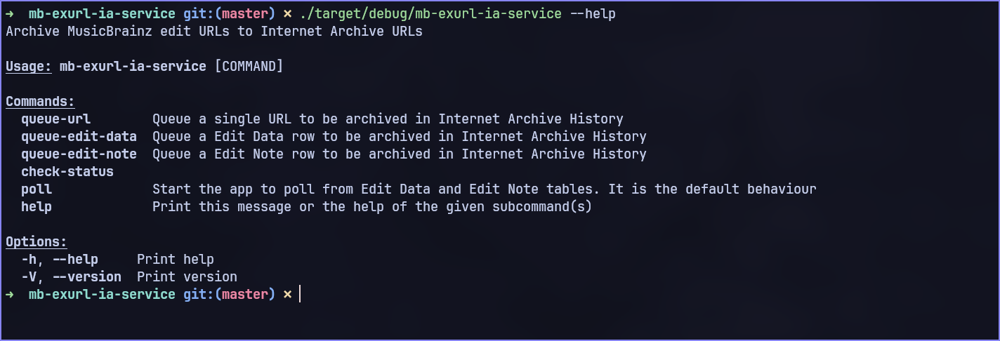
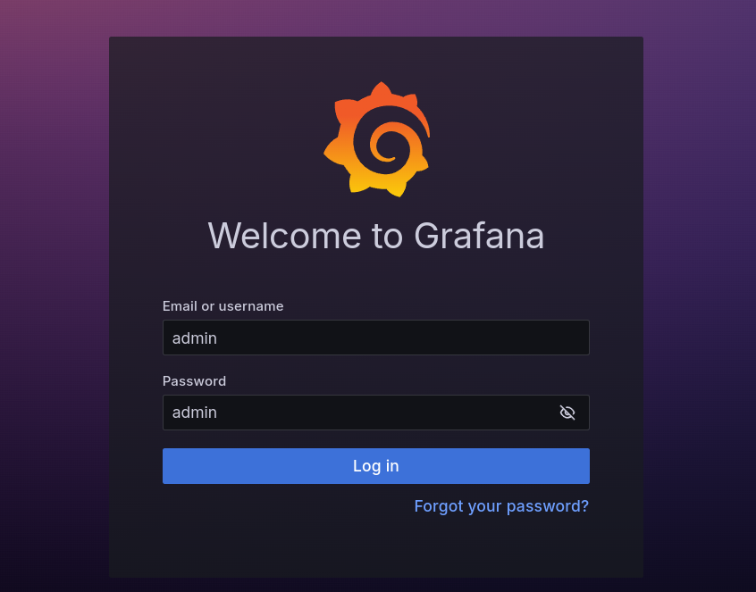
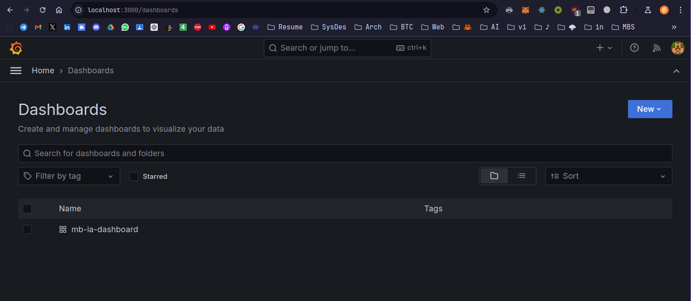
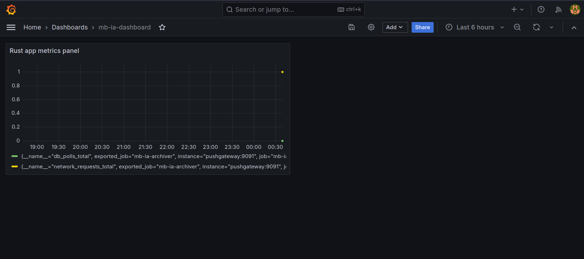
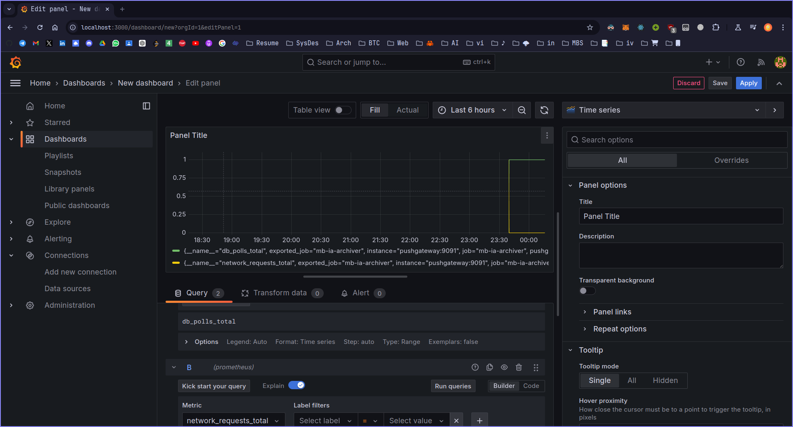

# MusicBrainz - External URLs - Internet Archive Service
(Sorry for such a long messy name, will update later ig)
- [Proposal Doc Link](https://docs.google.com/document/d/1Bk66_HFWEA6gBbFfQzIriGGgxxbEIwN1CbVDcz7FTys/edit?usp=sharing)

### Current Implementation (WIP)

We want to get URLs from `edit_data` and `edit_note` tables, and archive them in Internet Archive history.
The app provides multiple command line functionalities to archive URLs from `edit_data` and `edit_note` tables:


We create a `external_url_archiver` schema, under which we create the required table, functions, trigger to make the service work.

Following are the long-running tasks:

1. `poller task`
   - Create a `Poller` implementation which:
     - Gets the latest `edit_note` id `edit_data` edit from `internet_archive_urls` table. We start polling the `edit_note` and `edit_data` from these ids.
   - Poll `edit_note` and `edit_data` table for URLs
   - Transformations to required format
   - Save output to `internet_archive_urls` table
2. `archival task`
   - Has 2 parts:
     1. `notifer`
         - Creates a `Notifier` implementation which:
           - Fetches the last unarchived URL row from `internet_archive_urls` table, and start notifying from this row id.
           - Initialises a postgres function `notify_archive_urls`, which takes the `url_id` integer value, and sends the corresponding `internet_archive_urls` row through the channel called `archive_urls`.
         - This periodically run in order to archive URLs from `internet_archive_urls`.
     2. `listener`
         - Listens to the `archive_urls` channel, and makes the necessary Wayback Machine API request (The API calls are still to be made).
         - The listener task is delayed for currently 5 seconds, so that no matter how many URLs are passed to the channel, it only receives 1 URL per 5 seconds, in order to work under IA rate limits.
3. `retry/cleanup task`
   - Runs every 24 hours, and does the following:
     1. If the `status` of the URL archival is `success`, and the URL is present in the table for more than 24 hours, cleans it.
     2. In case the URL's status is still null which means pending, it resends the URL to `archive_urls` channel from `notify_archive_urls` function, so that it can be re-archived.

### See the app architecture [here](./docs/architecture.md)

### Local setup
> - Make sure musicbrainz db and the required database tables are present.
> - Follow https://github.com/metabrainz/musicbrainz-docker to install the required containers and db dumps.
> - Rename the `.env.example` to `.env`.
> - After ensuring musicbrainz_db is running on port 5432, Run the script `init_db.sh` in scripts dir.
> - In `config/development.toml` file, make sure to create a sentry rust project, enter your sentry project [DSN](https://docs.sentry.io/platforms/rust/#configure) (Data Source Name) in the `url` key's value. 
> - Get the Internet Archive API accesskey and secret from [here](https://archive.org/account/s3.php) (requires sign in). Paste them in `config/development.toml` file `[wayback_machine_api]`'s variables `myaccesskey` and `mysecret`.


There are 2 methods to run the program:
1. Build the project and run.
    - Make sure rust is installed.
   - ```shell
        cargo build &&
        ./target/debug/mb-ia
        ```
2. Use the Dockerfile
   - Note that the container has to run in the same network as musicbrainz db network bridge.
   1.  ```shell
       cargo sqlx prepare
       ```

   2. ```shell
      docker-compose -f docker/docker-compose.dev.yml up --build
      ```

#### Setting up Prometheus, Grafana

1. On your browser, go to `localhost:3000`, to access grafana. Login using admin as username and password.

    

2. Go to Dashboard. Select `mb-ia-dashboard`.

    

3. If the `Rust app metrics panel` shows no data, just click on the refresh icon on top right corner. 

       

4. To edit, right-click on the panel and select edit option. You can edit the panel, and save the generated json in `grafana/dashboards/metrics-dashboard.json`.

    
