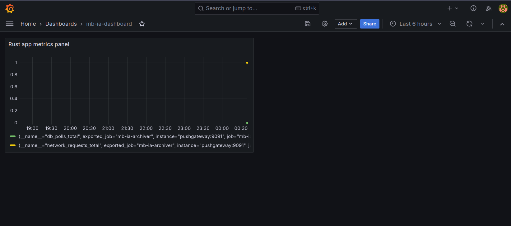

# Installing the app

> - Make sure musicbrainz db and the required database tables are present.
> - Follow https://github.com/metabrainz/musicbrainz-docker to install the required containers and db dumps.
> - Rename the `.env.example` to `.env`, to set the `RUN_MODE` to `development`.
> - Rename `config/default.example.toml` to `config/default.toml`, `config/development.example.toml` to `config/development.toml` and `config/production.example.toml` to `config/production.toml`.
> - Ensure [yq](https://github.com/mikefarah/yq) is installed, for using configs in the sql scripts.
> - After ensuring musicbrainz_db is running on port 5432, Run the script `init_db.sh` in scripts dir.
> - In `config/development.toml` file, create a sentry rust project, enter your sentry project [DSN](https://docs.sentry.io/platforms/rust/#configure) (Data Source Name) in the `url` key's value.
> - Get the Internet Archive API accesskey and secret from [here](https://archive.org/account/s3.php) (requires sign in). Paste them in `config/development.toml` file `[wayback_machine_api]`'s variables `myaccesskey` and `mysecret`.

There are 2 methods to run the program:
1. Build the project and run.
    - Make sure rust is installed.
    - ```shell
        cargo build &&
        ./target/debug/mb-ia
        ```
2. Use the Dockerfile
    - Note that the container has to run in the same network as musicbrainz db network bridge.
       ```shell
       docker-compose -f docker/docker-compose.dev.yml up --build
       ```

## Setting up Prometheus, Grafana

1. On your browser, go to `localhost:3000`, to access grafana. Login using admin as username and password.

   

2. Go to Dashboard. Select `mb-ia-dashboard`.

   

3. If the `Rust app metrics panel` shows no data, just click on the refresh icon on top right corner.

   

4. To edit, right-click on the panel and select edit option. You can edit the panel, and save the generated json in `grafana/dashboards/metrics-dashboard.json`.

   
